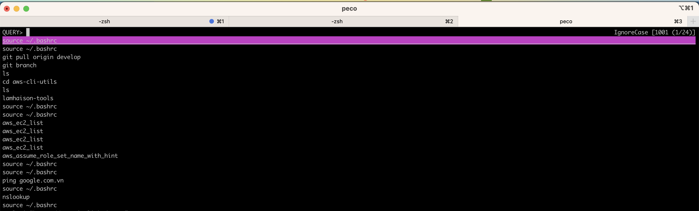

# helpful-commandlines
This is the repo to collect helpful commandlines that is used for mac and linux os.


## Setup dependencies
Notes: This document is for macos environment.

### Install gitlab cli
```
brew install glab
export GITLAB_TOKEN=xxxxx
```

### Install Github cli
```
brew install gh
export GH_TOKEN=xxxx
```

### Install peco
To allow searching by console.


```
brew install peco
peco --version
peco version v0.5.10 (built with go1.19.2)
```

### Install jq
```
brew install jq
jq --version
jq-1.6
```


## Setup lhs-helpful-commandlines
### Setup from homebrew
#### Install
```
brew tap lamhaison/formulae
brew install lamhaison/formulae/lhs-helpful-commandlines
```
## Load when start an Iterm terminal
Add these lines to ~/.bashrc or ~/.zshrc or ~/.bash_profile
```
source "$(which lhs-helpful-commandlines.sh)" "/opt/homebrew/Cellar/lhs-helpful-commandlines/$(brew info lhs-helpful-commandlines | head -1 | awk -F "stable " '{print $2}')" "${HOME}" "True"

```

### Re-install the latest version
```
brew uninstall lhs-helpful-commandlines
brew untap lamhaison/formulae
brew tap lamhaison/formulae
brew install lamhaison/formulae/lhs-helpful-commandlines
```

## Settings when open terminal (I am using iterm)
```
mkdir -p /opt/lamhaison-tools && cd /opt/lamhaison-tools
git clone https://github.com/lamhaison/helpful-commandlines.git
echo "source /opt/lamhaison-tools/helpful-commandlines/main.sh" >> ~/.bashrc
```

# How to search commandline
```
Ctrl + H for search list commandline
Option + R for search history

```

# How to enable git commit suggestions
```
Option + gc or lhs_git_commit_suggestions | peco
```

