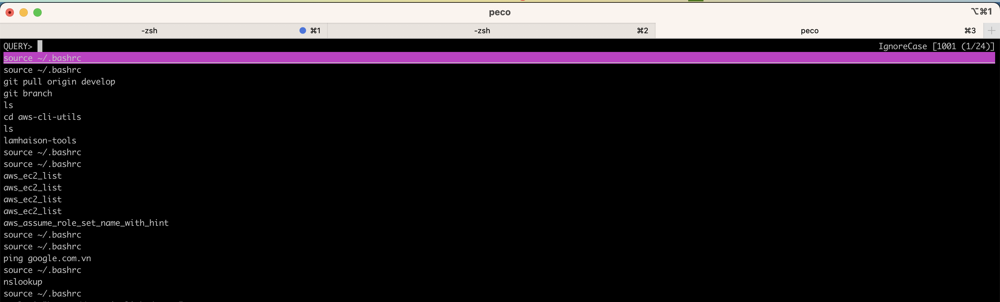

# helpful-commandlines
This is the repo to collect helpful commandlines that is used for MAC OS.

> **Security Notice**: This repository implements automated security scanning to prevent credential leaks and ensure code quality. See [SECURITY.md](SECURITY.md) for our security policy and CI/CD checks.

## Setup dependencies
Notes: This document is for macos environment.

### Install GitHub cli
```
brew install gh
export GH_TOKEN=xxxx
```

### Install peco
To allow searching by console.


```
brew install peco
peco --version
peco version v0.5.10 (built with go1.19.2)
```

### Install jq
```
brew install jq
jq --version
jq-1.6
```


## Setup lhs-helpful-commandlines
### Setup from homebrew
**It is easy to setup and run and don't want to change or optimize it**
#### Install
```
brew tap lamhaison/formulae
brew install lamhaison/formulae/lhs-helpful-commandlines
```
## Load when start an Iterm terminal
Add these lines to ~/.bashrc or ~/.zshrc or ~/.bash_profile
```
source "$(which lhs-helpful-commandlines.sh)" "/opt/homebrew/Cellar/lhs-helpful-commandlines/$(brew info lhs-helpful-commandlines | grep -E '==> .*: stable (.*)$' | sed -E 's|==> .*: stable (.*)$|\1|g')" "True" "True"
```

### Re-install the latest version(If there are new versions)
```
brew uninstall lhs-helpful-commandlines
brew untap lamhaison/formulae
brew tap lamhaison/formulae
brew install lamhaison/formulae/lhs-helpful-commandlines
```

## Settings when open terminal (I am using Iterm2)
**It is easy for you to custom your scripting to fix with your style**

```
mkdir -p /opt/lamhaison-tools && cd /opt/lamhaison-tools
git clone https://github.com/lamhaison/helpful-commandlines.git
echo "source /opt/lamhaison-tools/helpful-commandlines/main.sh" >> ~/.bashrc
```

# How to use it?

## How to search helpful commandline
```
Ctrl + h: to and choose the commandline that you want to run(searching and enter to auto fill it to your terminal)
lhs_help_helpful cmd: only for searching, it will not automatically fill in to your terminal
```

## How to search your history commandlines
```
Option + r: to select the history commandline that you wan to re-run(searching and enter to auto fill it to your terminal)
search history commandline: only for searching history, it will not automatically fill in to your termial
```

## How to enable git commit suggestions
```
lhs_git_commit_suggestions: only for searching the list commit message pattern
```

## Security & Contributing

### 🔒 Security Commitment
- ✅ No hardcoded credentials or secrets
- ✅ Automated secret detection on every commit
- ✅ Shell script validation and quality checks
- ✅ Code formatting standards enforcement

**Report security issues**: See [SECURITY.md](SECURITY.md) - Do NOT open public issues for security vulnerabilities.

### CI/CD Security Checks
All pull requests are automatically scanned for:
- 🔐 Secrets and credentials (gitleaks)
- 🐚 Shell script quality (shellcheck)
- 🎨 Code formatting (shfmt)
- ✅ Syntax validation

View the [security workflow](.github/workflows/security.yml) and [changelog](CHANGELOG.md).

## License

This project is licensed under the Apache License 2.0 - see [LICENSE](LICENSE) file for details.

Notes: This document is for macos environment.

### Install GitHub cli
```
brew install gh
export GH_TOKEN=xxxx
```

### Install peco
To allow searching by console.


```
brew install peco
peco --version
peco version v0.5.10 (built with go1.19.2)
```

### Install jq
```
brew install jq
jq --version
jq-1.6
```


## Setup lhs-helpful-commandlines
### Setup from homebrew
**It is easy to setup and run and don't want to change or optimize it**
#### Install
```
brew tap lamhaison/formulae
brew install lamhaison/formulae/lhs-helpful-commandlines
```
## Load when start an Iterm terminal
Add these lines to ~/.bashrc or ~/.zshrc or ~/.bash_profile
```
source "$(which lhs-helpful-commandlines.sh)" "/opt/homebrew/Cellar/lhs-helpful-commandlines/$(brew info lhs-helpful-commandlines | grep -E '==> .*: stable (.*)$' | sed -E 's|==> .*: stable (.*)$|\1|g')" "True" "True"
```

### Re-install the latest version(If there are new versions)
```
brew uninstall lhs-helpful-commandlines
brew untap lamhaison/formulae
brew tap lamhaison/formulae
brew install lamhaison/formulae/lhs-helpful-commandlines
```

## Settings when open terminal (I am using Iterm2)
**It is easy for you to custom your scripting to fix with your style**

```
mkdir -p /opt/lamhaison-tools && cd /opt/lamhaison-tools
git clone https://github.com/lamhaison/helpful-commandlines.git
echo "source /opt/lamhaison-tools/helpful-commandlines/main.sh" >> ~/.bashrc
```

# How to use it?

## How to search helpful commandline
```
Ctrl + h: to and choose the commandline that you want to run(searching and enter to auto fill it to your terminal)
lhs_help_helpful cmd: only for searching, it will not automatically fill in to your terminal
```

## How to search your history commandlines
```
Option + r: to select the history commandline that you wan to re-run(searching and enter to auto fill it to your terminal)
search history commandline: only for searching history, it will not automatically fill in to your termial
```

## How to enable git commit suggestions
```
lhs_git_commit_suggestions: only for searching the list commit message pattern
```
